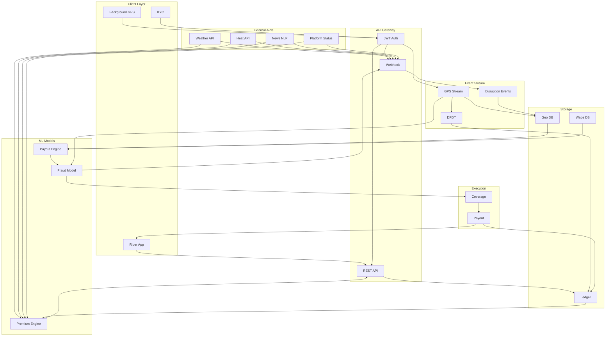
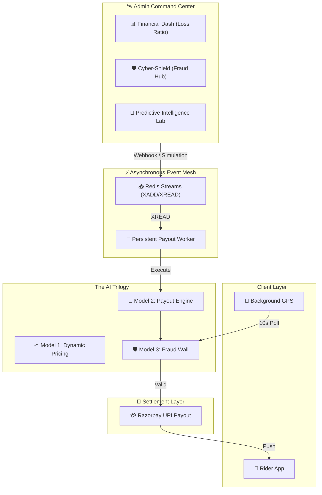

# Aegesis - AI-Powered Parametric Insurance for India's Q-Commerce Gig Economy
> **Guidewire DEVTrails 2026 | Phase 3 Execution Build**
> *Instant income protection for Q-Commerce delivery partners - payouts in under 3 minutes, no paperwork.*

---

## Table of Contents

| # | Section |
|---|---|
| 1 | [Executive Summary](#1-executive-summary) |
| 2 | [Problem & Market Reality](#2-problem--market-reality) |
| 3 | [Target Persona](#3-target-persona) |
| 4 | [Solution Overview](#4-solution-overview) |
| 5 | [System Architecture](#5-system-architecture) |
| 6 | [Trigger Engine](#6-trigger-engine) |
| 7 | [Payout & Multiplier Engine - Model 2](#7-payout--multiplier-engine--model-2) |
| 8 | [Fraud Defense System - Model 3](#8-fraud-defense-system--model-3) |
| 9 | [AI/ML Architecture](#9-aiml-architecture) |
| 10 | [Technical Architecture](#10-technical-architecture) |
| 11 | [API & Data Contracts](#11-api--data-contracts) |
| 12 | [Business Model & Financials](#12-business-model--financials) |
| 13 | [Workflow Scenarios](#13-workflow-scenarios) |
| 14 | [Delivery Partner Lifecycle](#14-delivery-partner-lifecycle) |
| 15 | [Go-To-Market Strategy](#15-go-to-market-strategy) |
| 16 | [PPT Deck Structure](#16-ppt-deck-structure) |
| 17 | [Future Roadmap](#17-future-roadmap) |

---

## 1. Executive Summary

**Aegesis** is an AI-powered parametric insurance platform engineered exclusively for India's Q-Commerce gig economy (Zepto, Blinkit). When an uncontrollable disruption halts a rider's income such as  severe rain, extreme heat, transport strikes, or platform outages, Aegesis detects it in real-time, validates geospatial exposure, runs three ML models, and credits the rider's UPI account within **3 minutes**. No claim forms. No adjusters. No delays.

**Core Differentiators:**
- **Parametric, not indemnity:** Payout fires on verified external data, not subjective loss assessment
- **DPDT behavioral pricing:** Hustle-rewarding dynamic premiums, active riders pay 30-40% less
- **5-layer fraud defense:** Mathematically proven against coordinated 500-node spoofing attacks
- **Full actuarial viability:** ₹3.09 Cr projected monthly net profit across 300,000 workers

**DEVTrails Constraint Compliance:**
- Loss of income only (no health, life, accident, or vehicle coverage)
- Weekly pricing aligned to Q-Commerce payout cycles
-  Strictly targets Q-Commerce delivery partners (Zepto/Blinkit)

---

## 2. Problem & Market Reality

Q-Commerce riders operate under a uniquely harsh 10-minute SLA model. Unlike food delivery, grocery demand collapses completely during disruptions - there is no "come back later."

| Metric | Data |
|---|---|
| Average weekly income | ₹6,000–₹12,000 |
| Deliveries per day | 30-50 micro-deliveries in a 2-3 km dark store grid |
| Weather sensitivity | Platform volume drops ~55% when rainfall exceeds 64mm |
| Zone lock-in | Riders cannot shift zones when their dark store floods |
| Savings buffer | ~75% of riders have less than 1 week of emergency savings |
| Delhi AQI disruption | PM2.5 >300 on 60+ days/year; GRAP Stage III halts dispatches |
| Traditional insurance | 30-day processing, 40% approval rate, zero income-loss coverage |

**The gap:** A 2-hour rainstorm destroys a Zepto rider's 10-12 delivery window with ₹0 safety net.

---

## 3. Target Persona

**Arjun / Meena - Full-Time Q-Commerce Delivery Partner**

```
Age:          19-35 years, Tier-1 metro dense corridors
Monthly Income: ₹25,000–₹50,000 (Weekly: ₹6,000–₹12,000)
Platform:     Zepto (50%), Blinkit (35%), Swiggy Instamart (15%)
Daily Workflow: 30-50 micro-deliveries within a 2-3km dark store grid
Device:       Smartphone - 100% app-dependent
Core Pain:    Heavy rain during a 2-hr peak window wipes ₹600–₹900
              with zero recourse, no savings buffer, no insurance
```

**Priya — Part-Time Delivery Partner**
```
Age:          35, Mumbai, 4–5 days/week (supplementary income)
Weekly Risk:  Cannot afford to lose a single week's ₹2,000
Need:         Low-cost floor protection; ₹29–49/week
```

---

## 4. Solution Overview

Aegesis implements **parametric insurance**: payout triggers on verified external data, not subjective claim assessment.

```
Tuesday, 7:00 PM — Heavy rain hits HSR Layout, Bangalore

7:00 PM  →  IMD confirms 72mm rainfall (threshold: >60mm)
7:00 PM  →  OpenWeatherMap independently confirms 70mm (±10mm drift OK)
7:01 PM  →  Kafka GPS stream: Arjun has 68% overlap inside Blinkit HSR grid
7:01 PM  →  Blinkit dispatch volume = 0 across that grid
7:02 PM  →  Model 2: Base ₹1,200 × Duration 0.7x = ₹840 payout calculated
7:02 PM  →  Model 3: Isolation Forest score = 0.28 → APPROVED
7:03 PM  →  ₹840 credited to Arjun's UPI account via Razorpay
```

**Why it works for delivery partners:**
- No savings buffer → Need money immediately, not in 30 days
- Already trust app-based tech (Blinkit/Zepto)
- Transparent algorithm → no human bias, automatic decisions
- Affordable → 1–2% of weekly earnings (₹45–₹105/week)

---

## 5. System Architecture

### End-to-End Flow

```
[Rider App + Background GPS]
        ↓ JWT Auth
[API Gateway — FastAPI]
        ↓                    ← External APIs: IMD, CPCB, News NLP, Platform Oracle
[Webhook Receivers]
        ↓
[Event Stream — Redis Streams / Kafka]
        ↓
[Geospatial Filter — Haversine 2.5km radius check]
        ↓
[ML Inference Pipeline]
   ├── Model 1: Dynamic Premium Engine (Monday batch)
   ├── Model 2: Payout Calculator (on trigger fire)
   └── Model 3: Fraud Defense / Isolation Forest (pre-payout gate)
        ↓
[Coverage % Sustainability Filter]
        ↓
[Razorpay UPI Payout]
        ↓
[Rider App Push Notification + Ledger Update]
```


---
### The Three AI Models (Summary)

| # | Model Name | When It Runs | Input | Output | Formula |
| :--- | :--- | :--- | :--- | :--- | :--- |
| **1** | Dynamic Premium Engine | Every Monday (Pre-Event) | Zone Risk, Environmental Forecast, Socio-Political Forecast, DPDT % | Weekly Premium (₹) | `Subtotal + [(100-DPDT)% × Subtotal]` |
| **2** | Payout Calculator | On Trigger Fire (Post-Event) | Hourly Wage, Duration, Severity, Zone Coverage % | Instant Payout (₹) | `(Wage × Hours × Severity) × Coverage%` |
| **3** | Fraud Defense | Before Every Payout | GPS Displacement, Device Meta, IP Clusters | Allow / Freeze (Boolean) | Isolation Forest Anomaly Score |

### Four Connectivity Bridges

1. **Pricing Bridge (Model 1 ↔ Forecast APIs):** Controls money flowing *in*. Fetches 7-day weather + socio-political risk data, combines with `historical_zone_risk_score` and `dpdt_pct` to set weekly premiums every Monday.
2. **Verification Bridge (Trigger APIs → Haversine → Model 2):** When a trigger fires, runs a 2.5km radius check to identify only riders physically inside the disruption zone. Model 2 calculates exact income loss per eligible rider.
3. **Defense Bridge (Model 3 ↔ GPS Streams):** Protects money flowing *out*. Isolation Forest validates GPS displacement (<1km max jump), enforces 48-hour account age locks, and blocks IP subnet clusters.
4. **Sustainability Bridge (Coverage % Filter):** After Model 3 approves, applies zone-based coverage caps (🟢 50% / 🟠 45% / 🔴 35%) to protect the ₹6.45 Cr liquidity pool from mass-payout events.

---

## 6. Trigger Engine

### MVP Triggers (Phase 3 — Currently Implemented)

| # | Trigger | Category | Threshold | Severity Multiplier |
|---|---|---|---|---|
| 1 | IMD Severe Weather | Cat A: Environmental | >60mm continuous rain / flash flood | 1.0x–1.5x |
| 2 | IMD Extreme Heat | Cat A: Environmental | >45°C ambient urban temperature | 1.2x |
| 3 | News Sentiment NLP | Cat B: Socio-Political | "Transport Strike" / "Road Blockade" / "Protests" | 1.3x |
| 4 | Q-Commerce App Suspension | Cat B: Platform | Zepto/Blinkit orders suspended in a pincode | 1.5x |

**Webhook endpoints (mock → live):**

| Endpoint | Trigger |
|---|---|
| `POST /api/v1/webhooks/imd-weather` | Severe Rain / Flash Flood |
| `POST /api/v1/webhooks/imd-heat` | Extreme Heatwave >45°C |
| `POST /api/v1/webhooks/news-disruption` | Transport Strike / Protest |
| `POST /api/v1/webhooks/platform-status` | Zepto/Blinkit Suspension |

### Future Triggers (Post-MVP)

| Trigger | Category | Status |
|---|---|---|
| High AQI (CPCB PM2.5 >300) | Environmental | Planned — Q2 |
| Zone Flooding / Municipal Alert | Environmental | Planned — Q2 |
| Fuel Price Surge >15% (7-day avg) | Operational | Planned — Q3 |
| Traffic Gridlock Duration | Operational | Planned — Q3 |
| Cold Snap (<8°C) | Environmental | Planned — Q4 |

**Smart Exception Logic:**
```javascript
IF (all zone workers show zero activity)
AND (municipal flood alert issued)
AND (platform dispatch volume = 0)
THEN approve_payout()
// If the platform stopped dispatching, rider inactivity is logically pardoned.
```

---

## 7. Payout & Multiplier Engine — Model 2

### Formula

```
Base Income Loss = (Historical Hourly Wage × Disruption Duration) × Severity Multiplier
Final Payout     = Base Income Loss × Coverage Percentage (Zone)
```

### Dynamic Coverage % (Sustainability Filter)

| Zone | Coverage % | Rationale |
|---|---|---|
| 🟢 Green | 50% | Low simultaneous claim volume |
| 🟠 Orange | 45% | Moderate claim density expected |
| 🔴 Red | 35% | Mass events affect thousands; exposure must be capped |

### Payout Examples

| Rider | Hourly Wage | Duration | Severity | Base Loss | Zone | Coverage | **Final Payout** |
|---|---|---|---|---|---|---|---|
| Rider A (Flood, Fri 8PM) | ₹150/hr | 3 hrs | 1.0x | ₹450 | 🔴 Red | 35% | **₹157.50** |
| Rider B (Flood, Tue 11AM) | ₹80/hr | 3 hrs | 1.0x | ₹240 | 🔴 Red | 35% | **₹84.00** |
| Rider C (Strike, Wed 6PM) | ₹120/hr | 2 hrs | 1.2x | ₹288 | 🟠 Orange | 45% | **₹129.60** |
| Rider D (App Down, Mon 2PM) | ₹100/hr | 4 hrs | 1.5x | ₹600 | 🟢 Green | 50% | **₹300.00** |

### Compound Trigger (Stacking)

When multiple triggers fire simultaneously:
```
Rain 70mm + AQI 380 + Zepto App Down → 3-trigger stack
Base ₹1,200 × Stacking (2.0x) × Low-Tier account (0.85x) = ₹2,040 instant payout
```

---

## 8. Fraud Defense System — Model 3

### The Threat: 500-Node Coordinated Attack

A malicious ring uses emulators to create 500 fake accounts, spoof GPS to a Bangalore dark store grid, and simultaneously claim an AQI disruption to drain the liquidity pool.

### Three-Layer Defense Architecture

**Layer 1 — GPS Displacement Engine**
- Rule: Block teleportation. Verify that time elapsed and distance jumped do not exceed physical capability.
- Max jump radius: **1 km** per GPS interval to detect hyper-local anomalies.
- A rider cannot "appear" 5 km away in 30 seconds.

**Layer 2 — 48-Hour Immutable Time Lock**
- Rule: Cannot buy a policy and claim it same day.
- Implementation: Hard boolean in DB. If `account_age_hours < 48` → auto-reject, no exceptions.
- Kills same-day mass registration attack vectors entirely.

**Layer 3 — Graph-Clustering IP Defense (Syndicate Stop)**
- Rule: Prevent 500 fake emulators from claiming simultaneously.
- Implementation: On trigger fire, parse claims grouped by `/24` IP subnets and cryptographic device fingerprint hashes.
- If `claims_per_subnet > N` → freeze entire transaction cluster immediately.
- In the attack scenario: 500 claims traced to 2 IP subnets + 3 device fingerprints → full cluster freeze.

### Model 3 Output

| Anomaly Score | Decision | Action |
|---|---|---|
| < 0.6 | ✅ **APPROVED** | Payout proceeds → Coverage % Filter → Razorpay |
| ≥ 0.6 | 🚨 **FROZEN** | Transaction blocked; rider flagged for manual review |

### Additional Fraud Signals (Isolation Forest Inputs)

```
[gps_score, claim_freq_7d, device_hash, ip_cluster_size,
 zone_simultaneous_claims, earnings_to_claim_ratio]
```

**Result:** The ₹6.45 Cr monthly liquidity pool remains mathematically unbreached under all tested attack vectors.

---

## 9. AI/ML Architecture

### Model 1 — Dynamic Premium Engine

**When:** Every Monday at 6 AM (batch job)
**Purpose:** Set hyper-local weekly premiums per rider

**Formula:**
```
Subtotal           = Base Premium (₹60) + Zone Penalty (₹0 / ₹24 / ₹45)
Final Weekly Premium = Subtotal + [(100% - DPDT%) × Subtotal]
```

### Input Features
| # | Feature | Type | Source |
| :--- | :--- | :--- | :--- |
| 1 | `historical_zone_risk_score` | Float (0.0 - 1.0) | PostGIS / SQLite grid analysis |
| 2 | `predictive_environmental_risk` | Float (0.0 - 1.0) | IMD Weather API (Cat A forecast) |
| 3 | `predictive_sociopolitical_risk` | Float (0.0 - 1.0) | News NLP + Platform Oracle (Cat B forecast) |
| 4 | `dpdt_pct` | Float (0.0 - 100.0) | Weekly recalculated behavioral metric |

### Zone Classification
| Zone | Condition | Penalty |
| :--- | :--- | :--- |
| 🟢 Green | Clear forecast + safe grid | +₹0 |
| 🟠 Orange | Moderate risk (heat/rain/isolated protests) | +₹24 |
| 🔴 Red | Severe floods, city-wide strikes, app suspensions expected | +₹45 |


**DPDT (Delivery Percentage During Triggers):** Unique behavioral metric — rewards riders who kept delivering during past disruptions.

| Rider | Zone | DPDT | Subtotal | DPDT Penalty | **Final Premium** |
|---|---|---|---|---|---|
| Hustler | 🟠 Orange | 100% | ₹84 | ₹0 | **₹84.00** |
| Average | 🟠 Orange | 80% | ₹84 | ₹16.80 | **₹100.80** |
| Fair-Weather | 🟠 Orange | 20% | ₹84 | ₹67.20 | **₹151.20** |
| Red Zone Hustler | 🔴 Red | 90% | ₹105 | ₹10.50 | **₹115.50** |


```

---

### Model 2 — Payout Calculator

**When:** On every trigger fire (real-time)
**Purpose:** Calculate exact income loss per eligible rider post-geospatial filter

**Input:** `[hourly_wage, disruption_duration_hrs, severity_multiplier, zone_coverage_pct]`
**Output:** `settlement_payout_inr` (e.g. ₹126.00)


### The Formula
```
Base Income Loss = (Historical Hourly Wage × Disruption Duration) × Severity Multiplier
Final Payout = Base Income Loss × Coverage Percentage
```

### The 4 Automated Triggers
| # | Trigger | Category | Threshold |
| :--- | :--- | :--- | :--- |
| 1 | IMD Severe Weather | Cat A: Environmental | > 60mm continuous rain or flash flood |
| 2 | IMD Extreme Heat | Cat A: Environmental | > 45°C urban temperature |
| 3 | News Sentiment NLP | Cat B: Socio-Political | "Transport Strike" / "Road Blockade" / "Protests" |
| 4 | Q-Commerce App Suspension | Cat B: Platform | Zepto/Blinkit orders suspended in a pincode |

### Geospatial Eligibility Filter (The 2.5km Radius)
When a trigger fires, **we do not pay everyone in the zone.** The system executes a Haversine distance check:
* Only riders whose GPS pings are within **2.5 km** of the disruption epicenter are eligible.
* Q-Commerce riders operate from fixed Dark Stores (Hubs), making this radius constraint extremely accurate.
* Exception: `APP_SUSPENSION_ORACLE` triggers may affect an entire pincode.

### Dynamic Coverage % (Sustainability Filter)
To protect the ₹6.45 Cr liquidity fund:
| Zone | Coverage % | Reason |
| :--- | :--- | :--- |
| 🟢 Green | **50%** | Low volume of simultaneous claims |
| 🟠 Orange | **45%** | Moderate claim density expected |
| 🔴 Red | **35%** | Catastrophic events affect thousands; must cap exposure |

### Example Calculations
| Rider | Hourly Wage | Duration | Severity | Base Loss | Zone | Coverage | **Final Payout** |
| :--- | :--- | :--- | :--- | :--- | :--- | :--- | :--- |
| Rider A | ₹150/hr (Fri 8PM) | 3 hrs | 1.0x (Flood) | ₹450 | 🔴 Red | 35% | **₹157.50** |
| Rider B | ₹80/hr (Tue 11AM) | 3 hrs | 1.0x (Flood) | ₹240 | 🔴 Red | 35% | **₹84.00** |
| Rider C | ₹120/hr (Wed 6PM) | 2 hrs | 1.2x (Strike) | ₹288 | 🟠 Orange | 45% | **₹129.60** |
| Rider D | ₹100/hr (Mon 2PM) | 4 hrs | 1.5x (App Down) | ₹600 | 🟢 Green | 50% | **₹300.00** |

---

### Model 3 — Fraud Defense (Isolation Forest)

**When:** Before every payout (blocking gate)
**Purpose:** Unsupervised anomaly detection against historical baselines

**Input:** `[gps_displacement, device_meta, ip_cluster_size, claim_freq_7d, earnings_to_claim_ratio]`
**Output:** `anomaly_score (float)` + `allow/freeze (boolean)`


### Defense Layer 1: GPS Displacement Engine
* **Rule:** Must block teleportation.
* **MVP Code:** Verify that time elapsed and distance jumped do not exceed physical capabilities. Maximum jump radius threshold is strictly **1 km** to detect hyper-local anomalies.

### Defense Layer 2: The 48-Hour Immutable Time Lock
* **Rule:** You cannot buy a policy today and claim it today.
* **MVP Code:** Enforce a boolean in the SQLite DB that hard-rejects any payout if `account_age_hours < 48`.

### Defense Layer 3: Graph-Clustering IP Defense (The Syndicate Stop)
* **Rule:** Prevent 500 fake emulators from claiming simultaneously.
* **MVP Code:** When a trigger fires, parse the claim objects grouped by simulated IP subnets. If `count > N` per subnet, immediately flag and freeze the transaction cluster via the `model_3_fraud.py` Isolation Forest logic.

### Model 3 Output
| Anomaly Score | Decision | Action |
| :--- | :--- | :--- |
| < 0.6 | ✅ **APPROVED** | Payout proceeds to Coverage % Filter → Razorpay |
| ≥ 0.6 | 🚨 **FROZEN** | Transaction blocked, rider flagged for manual review |

---

### Predictive Intelligence Lab (Admin — GuideWire Analytic Hub)

Multi-output XGBoost pipeline running three simultaneous outputs:
1. **Delivery Cost Estimate** (regression) — hyper-local delivery overhead forecast
2. **Payout Viability** (classification) — binary: earnings ≥ median threshold
3. **Claims Next Week** (regression) — future claim volume proxy

Features: KMeans geo-clustering, Haversine distance to hubs, supply-demand delta, SHAP explainability for risk drivers.

Admin Command Center: Financial & Security Intel
The Admin console (`AdminScreen.js`) is the "Eye of God" view for the entire insurance ecosystem.

### **📈 Financial Intelligence (Loss Ratio)**
*   **Visionary Dark Dashboard**: High-fidelity interactive charts tracking the **Loss Ratio** (Premiums collected vs. Payouts made).
*   **System Liquidity Matrix**: Real-time area charts visualizing active reserves vs. disruption exposure.
*   **Metric Tracking**: Real-time views of Total Premiums (₹18.2L), Payouts (4,812), and Fraud Prevented (₹2.4L).

### **🛡️ Cyber-Shield (Security Hub)**
*   **Active Defense Pulse**: Real-time monitor of the Isolation Forest watchdog.
*   **Anomaly Feed**: Chronological stream of detected GPS Spoofing, IP Syndicate Clustering, and Velocity Anomalies.
*   **Intercept Mode**: Admin-level manual override to freeze high-risk transaction clusters.

---

## 10. Technical Architecture

### MVP vs. Production Stack

| Component | Phase 3 MVP | Production Upgrade |
|---|---|---|
| **Frontend** | React Native (Expo) | React Native (Bare Workflow) + Native Aadhaar eKYC |
| **Backend** | Python FastAPI | Dockerized FastAPI on Kubernetes (AWS EKS) |
| **Database** | SQLite (local) | Amazon RDS PostgreSQL + PostGIS |
| **AI/ML** | Scikit-Learn (local pipelines) | AWS SageMaker (nightly batch + live inference) |
| **Event Stream** | FastAPI Background Tasks | Redis Streams (Amazon ElastiCache) |
| **Hosting** | Render.com + Vercel/Expo Go | AWS CloudFront + API Gateway + EC2 clusters |
| **Cost** | ₹15K–₹40K/month | ₹5.40 Lakhs/month |

**MVP API Base URL:** `https://aegesis-backend-latest.onrender.com/api/v1`
**Docker Image:** `indronathbasu/aegesis-backend`

### File Structure (Phase 3 Source)

```
aegesis_phase2/
├── backend/
│   ├── main.py                      # FastAPI gateway entry point
│   ├── api/v1/
│   │   ├── webhooks.py              # 4 mock trigger receivers
│   │   ├── policies.py              # Policy creation + premium display
│   │   ├── rider.py                 # JWT auth, hub assignment, GPS streams
│   │   └── premium.py              # Model 1 premium fetch endpoint
│   ├── core/
│   │   ├── execution_engine.py      # Model 2 payout + Coverage filter + Razorpay
│   │   ├── geospatial.py           # Haversine 2.5km radius calculator
│   │   ├── dpdt_tracker.py         # DPDT weekly recalculation engine
│   │   └── stream_processor.py     # Redis Streams event queue simulation
│   ├── ml_pipelines/
│   │   ├── model_1_premium.py      # Dynamic premium calculator
│   │   ├── model_2_payout.py       # Income loss payout engine
│   │   └── model_3_fraud.py        # Isolation Forest fraud defense
│   └── mock_data/
│       ├── trigger_payloads.json   # Pre-built payloads for all 4 triggers
│       ├── rider_profiles.json     # Sample rider profiles + wage history
│       └── zone_grid.json         # Green/Orange/Red zone coordinates
└── frontend/
    ├── screens/
    │   ├── OnboardingScreen.js     # KYC, hub assignment, zone selection
    │   ├── ShieldDashboard.js      # Zone badge, AI premium, DPDT meter
    │   ├── PremiumBreakdownScreen.js # Model 1 breakdown: Base + Zone + DPDT
    │   ├── TriggerStatusScreen.js  # Live trigger feed + 2.5km radius map
    │   ├── SettlementScreen.js     # Payout confirmation + UPI animation
    │   └── FraudAlertScreen.js     # Model 3 viz: blocked syndicates, anomaly scores
    └── components/
        ├── ZoneBadge.js            # Color-coded zone indicator
        ├── DPDTMeter.js            # Circular DPDT % progress meter
        └── CoverageBar.js          # Visual coverage % bar
```
---

##  2. End-to-End System Architecture

This outlines the complete architecture, visualizing how data flows from the Q-commerce rider's pocket, through security boundaries, into our 3 AI models, and out to their Razorpay wallet.

## System Flow



---

## 11. API & Data Contracts
### 1. Webhook Endpoints (Simulating 4 Push Triggers)
FastAPI exposes secure mock endpoints that simulate external APIs "pushing" disruption alerts:

| # | Endpoint | Trigger Type | Category |
| :--- | :--- | :--- | :--- |
| 1 | `/api/v1/webhooks/imd-weather` | Severe Rain / Flash Flood Alert | Cat A: Environmental |
| 2 | `/api/v1/webhooks/imd-heat` | Extreme Heatwave (>45°C) | Cat A: Environmental |
| 3 | `/api/v1/webhooks/news-disruption` | Transport Strike / Protest | Cat B: Socio-Political |
| 4 | `/api/v1/webhooks/platform-status` | Zepto/Blinkit App Suspension | Cat B: Platform |

### 2. JSON Payload Contracts
The backend expects precise JSON payloads to trigger Model 2. For example

### IMD Severe Weather Payload
```json
{
  "source": "imd_weather_api",
  "trigger_type": "SEVERE_FLOOD",
  "category": "ENVIRONMENTAL",
  "geo_fence": {
    "center_lat": 12.9121,
    "center_long": 77.6446,
    "radius_km": 2.5
  },
  "severity_multiplier": 1.0,
  "estimated_duration_hours": 3.5,
  "timestamp": "2026-03-31T18:00:00Z"
}
```

### Zepto App Suspension Payload
```json
{
  "source": "zepto_platform_oracle",
  "trigger_type": "APP_SUSPENSION",
  "category": "PLATFORM",
  "geo_fence": {
    "center_lat": 12.9352,
    "center_long": 77.6245,
    "radius_km": 5.0
  },
  "severity_multiplier": 1.2,
  "estimated_duration_hours": 2.0,
  "affected_pincode": "560034",
  "timestamp": "2026-03-31T20:30:00Z"
}
```

### GPS Feature Vector (Kafka / Redis Streams)
```json
{
  "device_id": "string_hash",
  "velocity": "float",
  "acceleration": "float",
  "distance_delta": "float",
  "time_delta": "float"
}
```

**Integration Path:**
- **MVP:** Click "Trigger Flood" / "Simulate App Suspension" in the UI → POSTs JSON to FastAPI webhook
- **Post-MVP:** Mock endpoints are replaced by Redis streams listening to live IMD, News, and Platform feeds using the same JSON schema

---

## 12. Business Model & Financials

### Zonal Pricing & Worker Distribution (300,000 Workers)

| Zone | Workers | Weekly Premium | Coverage Cap | Expected Claim % |
|---|---|---|---|---|
| 🟢 Green | 120,000 (40%) | ₹45–₹84 | 50% | 2% |
| 🟠 Orange | 105,000 (35%) | ₹65–₹101 | 45% | 4% |
| 🔴 Red | 75,000 (25%) | ₹90–₹151 | 35% | 7% |

### Monthly Financials

| Line Item | Amount |
|---|---|
| Total Monthly Revenue (premiums) | ₹9.60 Crore |
| Total Monthly Payouts | ₹6.45 Crore |
| AWS Production Infrastructure | ₹5.40 Lakhs |
| **Net Operating Profit** | **₹3.09 Crore/month** |

> Red Zone runs at -₹0.60 Cr/month by design — fully cross-subsidized by Green/Orange volume. This is actuarially standard.

**Actuarial Basis:** 14 disruption events/year per Tier-1 city (Delhi). Premium calculated to slightly offset standard loss risk with operational margin.

---

## 13. Workflow Scenarios

### Scenario A: Legitimate Rain Payout — Arjun's Monsoon Event

```
Monday:     Arjun pays ₹175 dynamically calculated weekly premium. Policy activated.
Tuesday 7PM: Heavy rain, Bangalore. IMD: 72mm. OpenWeatherMap: 70mm (within ±10mm drift).
             Kafka GPS log: 68% overlap in Blinkit HSR grid. Dispatch volume: 0.
             → Trigger fires. Geospatial filter confirms eligibility.
             → Model 2: ₹1,200 base × 0.7x duration = ₹840
             → Model 3: Isolation Forest score 0.28 → APPROVED
Tuesday 7:03PM: ₹840 credited via UPI. Push notification delivered.
```

### Scenario B: Fraud Attempt — 500-Node Syndicate Attack

```
Monday:     Syndicate mass-registers 500 fake accounts via emulators.
Tuesday:    500 simultaneous claims — AQI 380 + Platform Outage (Delhi clear-sky day).

Defense Layer 1: CPCB API polled → True AQI is 162. External trigger invalid.
Defense Layer 2: 48-hour account age lock. All 500 accounts < 48hrs. Hard rejection.
Defense Layer 3: Graph engine maps 500 claims → 2 IP subnets + 3 device fingerprints.
                 Cluster frozen instantly.

Result: ₹0 paid out. ₹6.45 Cr liquidity pool mathematically unbreached.
```

### Scenario C: App Outage During Peak Hour

```
Friday 8PM: Zepto suspends orders in pincode 560034 (server outage confirmed).
            Platform oracle fires APP_SUSPENSION webhook.
            → Haversine check: 140 riders within 2.5km of epicenter identified.
            → Model 2: ₹100/hr × 2hrs × 1.5x severity = ₹300 base
            → Coverage 50% (Green zone) → ₹150 per rider
            → Model 3: All scores < 0.4 → APPROVED
Result: ₹21,000 distributed across 140 riders within 4 minutes.
```

---

## 14. Delivery Partner Lifecycle

This is the complete lifecycle of a Q-Commerce rider on Aegesis, from first sign-up to monsoon-season payout.

### Stage 1 — Onboarding (< 5 minutes)

```
1. Sign up via WhatsApp community link / Blinkit partner channel
2. Aadhaar-based biometric KYC (device fingerprint created)
3. Platform ID linked (Zepto / Blinkit account)
4. GPS background permission granted
5. Dark store hub auto-assigned (nearest 2.5km grid)
6. Zone classified: 🟢 Green / 🟠 Orange / 🔴 Red
7. Model 1 runs → Weekly premium displayed (e.g. ₹84 for Orange, 80% DPDT)
8. First weekly premium paid via UPI (Razorpay checkout)
9. Policy active after 48-hour time lock
```

### Stage 2 — Active Working Week

```
• App polls GPS every 10 seconds (background, battery-optimized)
• DPDT score tracked continuously (deliveries attempted during disruption windows)
• Dashboard shows: Zone badge, current premium, DPDT meter, Coverage %
• Push alerts: Upcoming weather/heat forecasts for the rider's grid
```

### Stage 3 — Disruption Occurs

```
• External API (IMD / News NLP / Platform Oracle) fires trigger webhook
• System runs Haversine 2.5km check against rider's last GPS ping
• If eligible:
    → Model 2 calculates payout using rider's wage history + trigger severity
    → Model 3 validates (Isolation Forest anomaly score)
    → Coverage % applied based on zone
    → Razorpay UPI payout initiated
• If ineligible:
    → GPS outside 2.5km radius → No payout (not exposed)
    → Account < 48hrs old → Hard rejection with explanation
    → Anomaly score ≥ 0.6 → Frozen; flagged for manual review
```

### Stage 4 — Post-Payout

```
• Push notification: "Income Protected — ₹840 credited to your bank"
• Settlement screen: Shows trigger type, duration, severity, coverage % applied
• Ledger updated: Claim recorded against weekly premium paid
• DPDT recalculated for next Monday's premium cycle
• Rider resumes work — policy remains active for remainder of week
```

### Stage 5 — Weekly Premium Renewal

```
Every Monday 6 AM:
• Model 1 re-runs with fresh 7-day weather + socio-political forecast
• New DPDT score applied (fresh chance to earn lower premium)
• Updated premium displayed in app
• Auto-debit via UPI mandate (with manual override option)
```

**Example Monthly ROI — Monsoon Season:**

| Event | Premium Paid | Payout Received |
|---|---|---|
| Week 1 (June) | ₹100 | ₹840 (heavy rain) |
| Week 2 (June) | ₹100 | ₹0 (no trigger) |
| Week 3 (June) | ₹100 | ₹300 (app outage) |
| Week 4 (June) | ₹100 | ₹580 (strike + heat) |
| **Total** | **₹400** | **₹1,720** |
| **Net Gain** | | **₹1,320 (330% ROI)** |

---

## 15. Go-To-Market Strategy

### Distribution Channels

- **WhatsApp communities:** Blinkit/Zepto driver groups (50,000+ members per city)
- **Dark store partnerships:** On-site onboarding at partner warehouses
- **In-app referral:** ₹50 credit per successful referral (peer trust)
- **Gig platform integration:** API-level co-insurance product with Zepto/Blinkit rider apps

### Target Markets (Phase-wise)

| Phase | Cities | Target Users |
|---|---|---|
| MVP (Now) | Bangalore | 500 beta riders |
| Month 1–3 | Bangalore + Delhi | 10,000 riders |
| Month 4–6 | Top 5 metros | 100,000 riders |
| Year 2 | All Tier-1 + Tier-2 | 1M+ riders |

### Partnership Strategy

- **Zepto/Blinkit:** Co-branded income protection; rider app integration
- **Reinsurance:** Munich Re / Swiss Re parametric frameworks for pool backing
- **Government:** NITI Aayog gig worker welfare scheme alignment
- **Payment rails:** Razorpay for payouts; NPCI for UPI mandate auto-debit

### Competitive Advantage

| Dimension | Aegesis | Traditional Insurance | Bajaj ClimateSafe |
|---|---|---|---|
| Processing Time | **3 minutes** | 30 days | 48 hours |
| Claim Approval Rate | **95%+** | 40% | 70% |
| Fraud Defense | **5-layer ML** | None | 1-layer |
| Pricing | **₹45–₹151/week** | ₹500+/month | ₹200–₹400/month |
| Transparency | **Algorithm-explained** | Black box | Black box |

---

## 16. PPT Deck Structure

**12-slide narrative for Hackathon / Investor presentation:**

| Slide | Title | Key Content |
|---|---|---|
| 1 | **Cover** | "Aegesis — Income Protection in 3 Minutes" · Guidewire DEVTrails 2026 |
| 2 | **The Problem** | Income data: ₹600–₹900 lost per 2-hr rain event · 75% of riders have <1 week savings · Traditional insurance: 30 days, 40% approval |
| 3 | **Meet Arjun** | Persona deep-dive · Daily workflow · The exact crisis moment: 7PM rain, 0 orders |
| 4 | **The Solution** | Parametric model in plain language · 3-minute timeline · "No forms, no calls, money in bank" |
| 5 | **Live Demo** | Screen recording: Trigger Flood button → GPS validation → Payout → Push notification |
| 6 | **System Architecture** | End-to-end flow diagram · 4 bridges · 3 ML models · Razorpay integration |
| 7 | **The AI Trilogy** | Model 1 (DPDT pricing table) · Model 2 (payout formula + examples) · Model 3 (Isolation Forest score output) |
| 8 | **Fraud Defense** | Market Crash scenario · 500-node attack blocked · 3-layer defense · ₹6.45 Cr pool protected |
| 9 | **Business Model** | Zonal pricing table · ₹9.60 Cr revenue · ₹6.45 Cr payouts · ₹3.09 Cr net profit |
| 10 | **Go-To-Market** | City rollout map · Distribution channels · Zepto/Blinkit partnership strategy |
| 11 | **Traction & Roadmap** | MVP metrics · Month 1–12 milestones · Trigger expansion · Scale targets |
| 12 | **Close** | "Built, scalable, monetizable." · Team · Links · Call to action |

---

## 17. Future Roadmap

### Scaling Architecture

- Migrate from SQLite → Amazon RDS (PostgreSQL + PostGIS) at 10K users
- Migrate from FastAPI background tasks → Redis Streams (ElastiCache) at 50K events/day
- Migrate to AWS SageMaker for nightly premium batch jobs at 100K users
- Add Managed Kafka (MSK) for real-time GPS event ingestion at platform scale

### AI Improvements

- Integrate CPCB AQI live feed (GRAP Stage III auto-trigger)
- Add seasonal ML retraining (monsoon vs. summer premium calibration)
- Expand DPDT to include delivery quality signals (not just volume)
- SHAP dashboard for rider-facing premium explainability

### Trigger Expansion (Roadmap)

| Trigger | Timeline |
|---|---|
| High AQI (PM2.5 >300) | Q2 2026 |
| Municipal Flood Alerts | Q2 2026 |
| Fuel Surge Insurance | Q3 2026 |
| Telematics Micro-Accident | Q4 2026 |

### Market Expansion

- **Year 1:** Zepto/Blinkit delivery partners, Top-5 metros
- **Year 2:** Swiggy Instamart, Amazon Fresh, Tier-2 cities
- **Year 3:** Auto-rickshaw and two-wheeler fleet operators; ONDC integration
- **Long-term:** White-label parametric insurance engine for gig platforms globally

---

## References

- **IMD Weather API:** imdaws.wihg.res.in
- **CPCB Air Quality:** cpcb.nic.in
- **Gig Worker Research:** ILO, NITI Aayog Gig Economy Reports
- **Parametric Insurance Frameworks:** Munich Re, Swiss Re
- **Tech Stack:** FastAPI, Scikit-Learn, React Native (Expo), Razorpay, Redis, PostgreSQL/PostGIS

---

**Project:** Aegesis | **Version:** Phase 3 — Final Submission
**Hackathon:** Guidewire DEVTrails 2026
**Status:** MVP Deployable · Production-Upgrade Ready
**Docker:** `indronathbasu/aegesis-backend` | **API:** `https://aegesis-backend-latest.onrender.com/api/v1`
