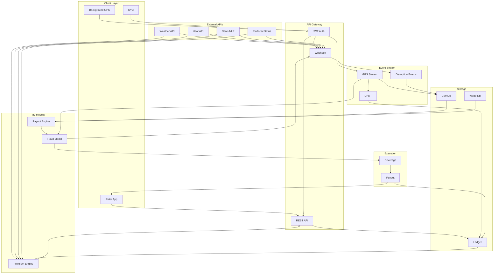
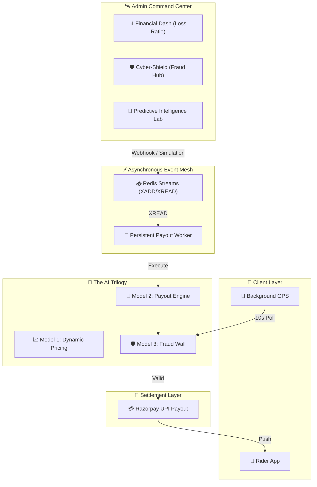

#  Aegesis Phase 3 Execution & Integration Plan

This document outlines everything needed to execute the Phase 3 Minimum Viable Product (MVP) for the **Guidewire DEVTrails** hackathon. Aegesis is an **AI-Powered Parametric Insurance Platform** built exclusively for **Quick Commerce (Q-Commerce) 2-wheeler delivery partners** (Zepto / Blinkit). It is structured to allow a seamless upgrade into the commercial product described in the **Final Startup Roadmap** (Month 1 - 3).

---

##  1. Tech Stack (Phase 3 MVP vs. Production Upgrade)

We are selecting an MVP tech stack that maps perfectly 1-to-1 with your final Day 90 startup stack, ensuring no throwaway code.

| Component | Phase 3 MVP (Now) | Startup Roadmap Upgrade Path (Day 31+) |
| :--- | :--- | :--- |
| **Frontend** | **React Native (Expo)** - Fast prototyping | **React Native (Bare Workflow)** - Native Swift/Kotlin for Aadhaar eKYC |
| **Backend** | **Python FastAPI** - Async speed, ML ready | **Dockerized FastAPI** on Kubernetes (AWS EKS) |
| **Database** | **SQLite** - Local, zero-config, portable | **Amazon RDS (PostgreSQL + PostGIS)** for massive geospatial scale |
| **AI / ML** | **Scikit-Learn (Local)** - 3 Python ML pipelines | **AWS SageMaker** - Nightly batch jobs & live inference |
| **Event Stream** | **FastAPI Background Tasks** | **Redis Streams (Amazon ElastiCache)** - Non-blocking queues |

---

##  2. End-to-End System Architecture

This outlines the complete architecture, visualizing how data flows from the Q-commerce rider's pocket, through security boundaries, into our 3 AI models, and out to their Razorpay wallet.

## System Flow



---
### The Three AI Models (Summary)

| # | Model Name | When It Runs | Input | Output | Formula |
| :--- | :--- | :--- | :--- | :--- | :--- |
| **1** | Dynamic Premium Engine | Every Monday (Pre-Event) | Zone Risk, Environmental Forecast, Socio-Political Forecast, DPDT % | Weekly Premium (₹) | `Subtotal + [(100-DPDT)% × Subtotal]` |
| **2** | Payout Calculator | On Trigger Fire (Post-Event) | Hourly Wage, Duration, Severity, Zone Coverage % | Instant Payout (₹) | `(Wage × Hours × Severity) × Coverage%` |
| **3** | Fraud Defense | Before Every Payout | GPS Displacement, Device Meta, IP Clusters | Allow / Freeze (Boolean) | Isolation Forest Anomaly Score |

### The Four Connectivity Bridges

1. **The Pricing Bridge (Model 1 ↔ Forecast APIs):** Controls the flow of money *into* the pool. Model 1 fetches 7-day historical weather and socio-political risk aggregates from the **IMD + News plugins** and combines it with the rider's `historical_zone_risk_score` and `dpdt_pct` to output a dynamic weekly premium.
2. **The Verification Bridge (Trigger APIs → Geospatial Filter → Model 2):** When any of the 4 triggers fire, the system first runs a **Haversine distance check** (2.5km radius) against the trigger epicenter to identify only the Q-commerce riders who are actually affected. Model 2 then calculates the exact loss of income for each eligible rider.
3. **The Defense Bridge (Model 3 ↔ GPS Streams):** Protects money flowing *out*. The embedded `Scikit-Learn Isolation Forest` calculates an anomaly score using real-time GPS displacement (ensuring max jump remains < 1 km), 48-hour account age locks, and IP subnet clustering. A high score halts the payout.
4. **The Sustainability Bridge (Coverage % Filter):** After Model 3 approves a payout, the system applies a zone-based coverage cap (🟢 50%, 🟠 45%, 🔴 35%) to protect the ₹6.45 Cr liquidity pool from catastrophic Red Zone mass-payout events.

---

##  3. Hosting & Infrastructure (Production Details)

The Aegesis stack is optimized for low-latency inference and high availability.

| Component | Technology | Hosting Provider | Deployment Strategy |
| :--- | :--- | :--- | :--- |
| **Backend** | **Python FastAPI** | **Render.com** | Dockerized Container Deployment |
| **Frontend** | **React Native (Expo)** | **Vercel / Expo Go** | Managed Expo Workflow |
| **Database** | **PostgreSQL** | **Neon / Supabase** | Serverless SQL (Managed) |
| **AI Models** | **Scikit-Learn / XGBoost** | Hosted on Backend | Persistent JSON Artrefacts |
| **Image Registry** | **Docker Hub** | `indronathbasu/aegesis-backend` | Automated Webhook Deployments |

> [!NOTE]
> **API Base URL:** All mobile requests target `https://aegesis-backend-latest.onrender.com/api/v1`. The system uses dynamic Hub mapping, meaning it automatically detects the nearest Dark Store to your live GPS coordinates.

---

##  4. API Integration Flow

This specifies how we build the mock API data ingestion layer for the MVP so that it naturally unplugs to accept live data later.

### 1. Webhook Endpoints (Simulating 4 Push Triggers)
FastAPI exposes secure mock endpoints that simulate external APIs "pushing" disruption alerts:

| # | Endpoint | Trigger Type | Category |
| :--- | :--- | :--- | :--- |
| 1 | `/api/v1/webhooks/imd-weather` | Severe Rain / Flash Flood Alert | Cat A: Environmental |
| 2 | `/api/v1/webhooks/imd-heat` | Extreme Heatwave (>45°C) | Cat A: Environmental |
| 3 | `/api/v1/webhooks/news-disruption` | Transport Strike / Protest | Cat B: Socio-Political |
| 4 | `/api/v1/webhooks/platform-status` | Zepto/Blinkit App Suspension | Cat B: Platform |

### 2. JSON Payload Contracts
The backend expects precise JSON payloads to trigger Model 2. For example, the simulated **IMD Severe Weather Payload**:
```json
{
  "source": "imd_weather_api",
  "trigger_type": "SEVERE_FLOOD",
  "category": "ENVIRONMENTAL",
  "geo_fence": {
    "center_lat": 12.9121,
    "center_long": 77.6446,
    "radius_km": 2.5
  },
  "severity_multiplier": 1.0,
  "estimated_duration_hours": 3.5,
  "timestamp": "2026-03-31T18:00:00Z"
}
```

The simulated **Zepto App Suspension Payload** (The "Killer Feature"):
```json
{
  "source": "zepto_platform_oracle",
  "trigger_type": "APP_SUSPENSION",
  "category": "PLATFORM",
  "geo_fence": {
    "center_lat": 12.9352,
    "center_long": 77.6245,
    "radius_km": 5.0
  },
  "severity_multiplier": 1.2,
  "estimated_duration_hours": 2.0,
  "affected_pincode": "560034",
  "timestamp": "2026-03-31T20:30:00Z"
}
```

### 3. Integration Path
1. **MVP Execution:** You click a "Trigger Flood" or "Simulate App Suspension" button on the UI, which POSTs the JSON to the FastAPI webhook.
2. **Post-MVP Upgrade:** These mock endpoints get deleted, and the exact same JSON schemas are mapped to deployed Redis streams listening to live IMD, News, and Platform feeds.

---

##  5. File Structure

This is the exact directory structure for the Phase 3 source code executable, mapped entirely to the End-to-End architecture above:

```text
aegesis_phase2/
├── backend/
│   ├── main.py                          # Primary FastAPI Gateway Entry
│   ├── api/
│   │   └── v1/
│   │       ├── webhooks.py              # Mock payload receivers for all 4 triggers
│   │       │                            #   - /imd-weather (Cat A: Rain/Flood)
│   │       │                            #   - /imd-heat (Cat A: Extreme Heat)
│   │       │                            #   - /news-disruption (Cat B: Strikes/Protests)
│   │       │                            #   - /platform-status (Cat B: Zepto/Blinkit Suspension)
│   │       ├── policies.py              # Policy fetching, creation & weekly premium display
│   │       ├── rider.py                 # JWT Auth, Hub Assignment & GPS stream receivers
│   │       └── premium.py               # Endpoint to fetch Model 1 dynamic premium for a rider
│   ├── core/
│   │   ├── execution_engine.py          # Model 2 Payout Logic + Coverage % Filter + Razorpay
│   │   ├── geospatial.py               # Haversine distance calculator (2.5km radius check)
│   │   ├── dpdt_tracker.py             # DPDT calculation engine (weekly recalculation)
│   │   ├── stream_processor.py          # Simulating the Redis Streams event queues
│   │   └── config.py                    # Application configuration & constants
│   ├── database/
│   │   ├── session.py                   # SQLite logic (simulating PostgreSQL + PostGIS)
│   │   ├── models.py                    # Rider, Policy, Claim Ledger, DPDT History, GPS Log,
│   │   │                                #   Wage History, Zone Assignment tables
│   │   └── crud.py                      # Core Reads/Writes for all tables
│   ├── ml_pipelines/
│   │   ├── model_1_premium.py           # AI Model 1: Dynamic Subscription Premium Calculator
│   │   │                                #   Inputs: zone_risk, env_risk, sociopol_risk, dpdt_pct
│   │   │                                #   Output: weekly_premium_inr (e.g. ₹84.00)
│   │   ├── model_2_payout.py            # AI Model 2: Actionable Payout Engine
│   │   │                                #   Inputs: hourly_wage, duration, severity, coverage%
│   │   │                                #   Output: settlement_payout_inr (e.g. ₹126.00)
│   │   └── model_3_fraud.py             # AI Model 3: Isolation Forest Fraud Defense
│   │                                    #   Inputs: GPS displacement, device meta, IP clusters
│   │                                    #   Output: anomaly_score (float), allow/freeze (bool)
│   ├── mock_data/
│   │   ├── trigger_payloads.json        # Pre-built JSON payloads for all 4 trigger types
│   │   ├── rider_profiles.json          # Sample Q-commerce rider profiles with wage history
│   │   └── zone_grid.json              # Predefined Green/Orange/Red zone grid coordinates
│   └── requirements.txt                 # Python dependencies
│
└── frontend/
    ├── App.js                           # React Native entry point & screen navigator
    ├── services/
    │   ├── api.js                       # Axios/Fetch wrapper for all backend API calls
    │   └── BackgroundLocation.js        # Async Foreground/Background silent GPS tracker
    ├── screens/
    │   ├── OnboardingScreen.js          # Simulated KYC, Hub Assignment & Zone Selection
    │   ├── ShieldDashboard.js           # Main Dashboard: Zone indicator, AI premium display,
    │   │                                #   DPDT score, Coverage %, and trigger simulation buttons
    │   ├── PremiumBreakdownScreen.js    # [NEW] Detailed Model 1 breakdown showing:
    │   │                                #   Base ₹60 + Zone Penalty + DPDT Correction = Final ₹
    │   ├── TriggerStatusScreen.js       # [NEW] Live feed of active/past triggers with:
    │   │                                #   Trigger type, epicenter map pin, 2.5km radius visual,
    │   │                                #   affected rider count, and real-time payout status
    │   ├── SettlementScreen.js          # Payout confirmation: Amount, Coverage % applied,
    │   │                                #   Trigger type, Duration, and UPI credit animation
    │   └── FraudAlertScreen.js          # [NEW] Model 3 visualization: Shows blocked syndicate
    │                                    #   attacks, GPS teleportation detection, anomaly scores
    ├── components/
    │   ├── GlassCard.js                 # Glassmorphism floating card container
    │   ├── AnimatedButton.js            # Gradient button with spring press animation
    │   ├── CustomModal.js               # Dark blurred alert modal
    │   ├── ZoneBadge.js                 # [NEW] Color-coded zone indicator (Green/Orange/Red)
    │   ├── DPDTMeter.js                 # [NEW] Circular progress meter showing rider's DPDT %
    │   └── CoverageBar.js              # [NEW] Visual bar showing Coverage % for active zone
    ├── theme/
    │   └── colors.js                    # Centralized Q-Commerce color palette
    └── package.json                     # React Native dependencies
```

---

##  6. AI Plan — Model 1: Dynamic Premium Engine

> **Detailed specification:** See [`ai_model_1_spec.md`](./ai_model_1_spec.md)

**Phase 3 Goal:** Demonstrate mathematical, hyper-local weekly pricing for Q-Commerce riders.

### The Formula
```
Subtotal = Base Premium (₹60) + Zone Penalty (₹0 / ₹24 / ₹45)
Final Weekly Premium = Subtotal + [ (100% - DPDT%) × Subtotal ]
```

### Input Features
| # | Feature | Type | Source |
| :--- | :--- | :--- | :--- |
| 1 | `historical_zone_risk_score` | Float (0.0 - 1.0) | PostGIS / SQLite grid analysis |
| 2 | `predictive_environmental_risk` | Float (0.0 - 1.0) | IMD Weather API (Cat A forecast) |
| 3 | `predictive_sociopolitical_risk` | Float (0.0 - 1.0) | News NLP + Platform Oracle (Cat B forecast) |
| 4 | `dpdt_pct` | Float (0.0 - 100.0) | Weekly recalculated behavioral metric |

### Zone Classification
| Zone | Condition | Penalty |
| :--- | :--- | :--- |
| 🟢 Green | Clear forecast + safe grid | +₹0 |
| 🟠 Orange | Moderate risk (heat/rain/isolated protests) | +₹24 |
| 🔴 Red | Severe floods, city-wide strikes, app suspensions expected | +₹45 |

### DPDT (Delivery Percentage During Triggers)
The unique behavioral metric that rewards hardworking riders:
* **Recalculated every week** — riders get a fresh chance to improve their score.
* A rider with **100% DPDT** pays the bare minimum (e.g., ₹84 for Orange Zone).
* A rider with **20% DPDT** pays significantly more (e.g., ₹151.20 for Orange Zone).
* **Formula:** `DPDT Penalty = (100% - DPDT%) × Subtotal`

### Example Calculations
| Rider | Zone | DPDT | Subtotal | Penalty | Final Premium |
| :--- | :--- | :--- | :--- | :--- | :--- |
| Rider A (Hustler) | 🟠 Orange | 100% | ₹84 | ₹0 | **₹84.00** |
| Rider B (Average) | 🟠 Orange | 80% | ₹84 | ₹16.80 | **₹100.80** |
| Rider C (Fair-Weather) | 🟠 Orange | 20% | ₹84 | ₹67.20 | **₹151.20** |
| Rider D (Red Zone Hustler) | 🔴 Red | 90% | ₹105 | ₹10.50 | **₹115.50** |

---

##  7. AI Plan — Model 2: Payout Calculator

> **Detailed specification:** See [`ai_model_2_spec.md`](./ai_model_2_spec.md)

**Phase 3 Goal:** Demonstrate zero-touch, income-based parametric payouts with geospatial precision.

### The Formula
```
Base Income Loss = (Historical Hourly Wage × Disruption Duration) × Severity Multiplier
Final Payout = Base Income Loss × Coverage Percentage
```

### The 4 Automated Triggers
| # | Trigger | Category | Threshold |
| :--- | :--- | :--- | :--- |
| 1 | IMD Severe Weather | Cat A: Environmental | > 60mm continuous rain or flash flood |
| 2 | IMD Extreme Heat | Cat A: Environmental | > 45°C urban temperature |
| 3 | News Sentiment NLP | Cat B: Socio-Political | "Transport Strike" / "Road Blockade" / "Protests" |
| 4 | Q-Commerce App Suspension | Cat B: Platform | Zepto/Blinkit orders suspended in a pincode |

### Geospatial Eligibility Filter (The 2.5km Radius)
When a trigger fires, **we do not pay everyone in the zone.** The system executes a Haversine distance check:
* Only riders whose GPS pings are within **2.5 km** of the disruption epicenter are eligible.
* Q-Commerce riders operate from fixed Dark Stores (Hubs), making this radius constraint extremely accurate.
* Exception: `APP_SUSPENSION_ORACLE` triggers may affect an entire pincode.

### Dynamic Coverage % (Sustainability Filter)
To protect the ₹6.45 Cr liquidity fund:
| Zone | Coverage % | Reason |
| :--- | :--- | :--- |
| 🟢 Green | **50%** | Low volume of simultaneous claims |
| 🟠 Orange | **45%** | Moderate claim density expected |
| 🔴 Red | **35%** | Catastrophic events affect thousands; must cap exposure |

### Example Calculations
| Rider | Hourly Wage | Duration | Severity | Base Loss | Zone | Coverage | **Final Payout** |
| :--- | :--- | :--- | :--- | :--- | :--- | :--- | :--- |
| Rider A | ₹150/hr (Fri 8PM) | 3 hrs | 1.0x (Flood) | ₹450 | 🔴 Red | 35% | **₹157.50** |
| Rider B | ₹80/hr (Tue 11AM) | 3 hrs | 1.0x (Flood) | ₹240 | 🔴 Red | 35% | **₹84.00** |
| Rider C | ₹120/hr (Wed 6PM) | 2 hrs | 1.2x (Strike) | ₹288 | 🟠 Orange | 45% | **₹129.60** |
| Rider D | ₹100/hr (Mon 2PM) | 4 hrs | 1.5x (App Down) | ₹600 | 🟢 Green | 50% | **₹300.00** |

---

---

## 🔮 8. Predictive Intelligence Lab (GuideWire Analytic Hub)
Located in `GuideWire_MultiOUTPUT'`, this module provides the operational foresight required for financial sustainability.

### **Model Architecture: Multi-Output XGBoost**
Aegesis utilizes a **multi-output machine learning pipeline** that simultaneously predicts three critical metrics from a single operational feature set:
1.  **Delivery Cost Estimate (Regression)**: Forecasts hyper-local delivery overhead.
2.  **Payout Viability (Classification)**: Binary determination (1 if earnings ≥ median) to ensure rider sustainability.
3.  **Claims Next Week (Regression)**: Proxy for future claim volume based on historical frequency.

### **Key Features & Clusters**:
*   **Geo-Clustering**: Utilizes **KMeans** to segment the city into dynamic risk clusters.
*   **Feature Engineering**: Haversine distance to central hubs, supply-demand delta, and behavioral variability.
*   **Explainability**: Full **SHAP (Shapley Additive Explanations)** integration to visualize which features (e.g., rainfall, rider supply) are driving risk.

---

##  9. AI Plan — Model 3: Fraud Defense (Market Crash Engine)

**Phase 3 Goal:** Prove mathematically that the ₹6.45 Cr liquidity pool is safe from exploitation.

This is the crown jewel of Aegesis. The Phase 3 MVP must implement these three defense layers:

### Defense Layer 1: GPS Displacement Engine
* **Rule:** Must block teleportation.
* **MVP Code:** Verify that time elapsed and distance jumped do not exceed physical capabilities. Maximum jump radius threshold is strictly **1 km** to detect hyper-local anomalies.

### Defense Layer 2: The 48-Hour Immutable Time Lock
* **Rule:** You cannot buy a policy today and claim it today.
* **MVP Code:** Enforce a boolean in the SQLite DB that hard-rejects any payout if `account_age_hours < 48`.

### Defense Layer 3: Graph-Clustering IP Defense (The Syndicate Stop)
* **Rule:** Prevent 500 fake emulators from claiming simultaneously.
* **MVP Code:** When a trigger fires, parse the claim objects grouped by simulated IP subnets. If `count > N` per subnet, immediately flag and freeze the transaction cluster via the `model_3_fraud.py` Isolation Forest logic.

### Model 3 Output
| Anomaly Score | Decision | Action |
| :--- | :--- | :--- |
| < 0.6 | ✅ **APPROVED** | Payout proceeds to Coverage % Filter → Razorpay |
| ≥ 0.6 | 🚨 **FROZEN** | Transaction blocked, rider flagged for manual review |

---

---

## 10. Admin Command Center: Financial & Security Intel
The Admin console (`AdminScreen.js`) is the "Eye of God" view for the entire insurance ecosystem.

### **📈 Financial Intelligence (Loss Ratio)**
*   **Visionary Dark Dashboard**: High-fidelity interactive charts tracking the **Loss Ratio** (Premiums collected vs. Payouts made).
*   **System Liquidity Matrix**: Real-time area charts visualizing active reserves vs. disruption exposure.
*   **Metric Tracking**: Real-time views of Total Premiums (₹18.2L), Payouts (4,812), and Fraud Prevented (₹2.4L).

### **🛡️ Cyber-Shield (Security Hub)**
*   **Active Defense Pulse**: Real-time monitor of the Isolation Forest watchdog.
*   **Anomaly Feed**: Chronological stream of detected GPS Spoofing, IP Syndicate Clustering, and Velocity Anomalies.
*   **Intercept Mode**: Admin-level manual override to freeze high-risk transaction clusters.

---

## 11. Parametric Weather Oracles & Logic
Aegesis moves beyond "Proof of Loss" to **Parametric Thresholds**. 

### **Trigger Thresholds (IMD Integration)**:
| Trigger Type | Parametric Threshold | Severity Multiplier |
| :--- | :--- | :--- |
| **Severe Flood** | > 60mm continuous rainfall | 1.0x to 1.5x |
| **Extreme Heat** | > 45.0°C Ambient Temperature | 1.2x |
| **App Outage** | Official platform order suspension | 1.5x (Critical Loss) |

**RADIUS VERIFICATION**: Model 2 executes a mandatory **2.5km Haversine distance check**. Payouts are only triggered if the rider's last known GPS ping is within the epicenter of the disruption.

---

## 12. Razorpay Integration: Instant Settlement Flow
The "Micro-Payout" system ensures that funds reach the rider within seconds of a trigger.

1.  **Trigger Detection**: Admin simulation or Oracle POSTs a disruption payload.
2.  **Order Generation**: Backend calculates the payout: `(Hourly Wage * Duration * Severity) * Coverage%`.
3.  **Checkout Initiation**: ShieldDashboard detects the high-risk zone and launches the **Razorpay Checkout Modal**.
4.  **UPI Payout**: Funds are credited via the **Razorpay Route/Payouts API**, ensuring instant liquidity for the affected partner.

---

## 13. The AI Design Language (DPDT)
The cornerstone of Aegesis is the **Delivery Percentage During Triggers (DPDT)**.
*   **Logic**: Riders are rewarded for resilience. 
*   **Pricing**: `Final Premium = Base + [(100% - DPDT%) * Base]`.
*   **Result**: High-hustle riders pay 30-40% lower premiums than fair-weather workers.

---

